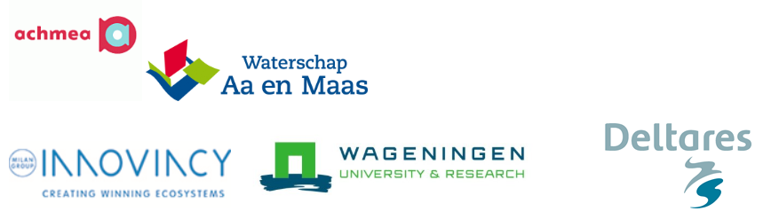

# Grow with the Flow

By combining the latest technological developments in the field of ICT, hydrological models, crop models and satellites, it is possible to develop a real-time forecasting system for crop production, enabling water boards, farmers and the insurance broker to improve their services and possibly reduce costs.

Therefore, a joint project proposal was made by Achmea (Agro), Deltares, the water boards Aa en Maas and Vechtstromen and Milan Innovincy, in collaboration with Wageningen University. 

## Aim of the project

- Setup a real-time forecasting crop modelling system that feeds the Achmea farmer app with relevant crop production data

- Calibrate the models and test them for practicality

- Test the usability of these data for the pilot farmers and the water boards involved

- Test the usefulness of these data for the determination and tracking of crop damage.

It was proposed to calculate the available soil moisture and crop production on a parcel basis with the coupled MODFLOW-MetaSWAP-WOFOST model during the 2018 growing season. 

The models were integrated into FEWS for real-time forecast of crop production. the output from FEWS feeds the developed app. 
The farmers app was made available to a selection of farmers in the pilot area.

## Partners/involved organisations

